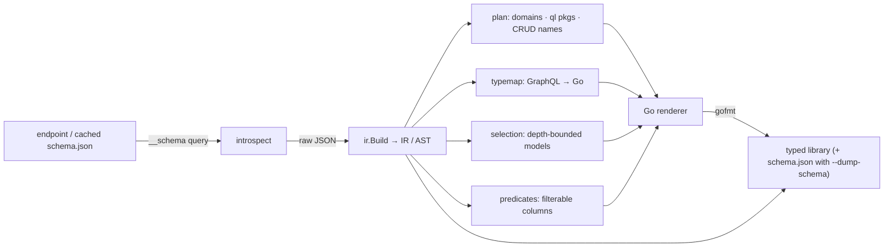
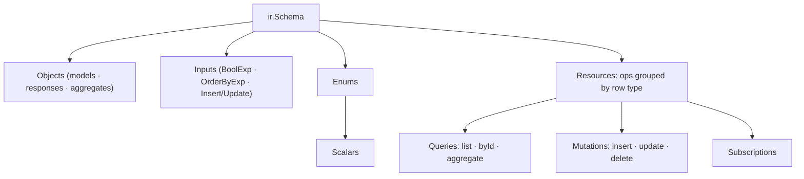

# GenerateQL

**Turn a GraphQL endpoint into a typed, idiomatic Go SDK — like `protoc`, but for GraphQL.**

[](https://github.com/oh-tarnished/generateql/releases)
[](https://pkg.go.dev/github.com/oh-tarnished/generateql)
[](go.mod)
[](https://github.com/oh-tarnished/generateql/actions/workflows/test.yaml)
[](LICENSE)

GenerateQL introspects any GraphQL server with standard introspection (Hasura, Grafbase /
Hasura DDN, Prisma-backed engines, …) and emits a self-contained Go **library**: typed models,
a fluent **predicate DSL** for filters, single-object create/update inputs, and one method per
query, mutation, and subscription — in clean per-domain packages on a small transport runtime.

No hand-written query strings, no struct tags, no pointers in your call sites.


## Contents

- [Overview](#overview)
- [Features](#features)
- [How it works](#how-it-works)
- [Install](#install)
- [Quick start](#quick-start)
- [Using the client](#using-the-client)
- [Configuration](#configuration)
- [CLI](#cli)
- [The runtime](#the-runtime)
- [Design notes](#design-notes)
- [Repository layout](#repository-layout)
- [License](#license)


```go
svc, _ := freebusyql.Connect(u)                       // *url.URL in

ins, _ := svc.Mutation.Organisation.Resource.Create(ctx, resourceql.CreateInput{
    Id: id, DisplayName: "BoB the Builder", Name: "organisations/" + id, MemberCount: 2,
})

rows, _ := svc.Query.Organisation.Resource.List(ctx, resourceql.List().
    Where(resourceql.And(resourceql.Id.Eq(id), resourceql.MemberCount.Gt(1))).
    OrderBy(resourceql.DisplayName.Desc()).
    Limit(10))
```

## Overview

Hand-written GraphQL query strings and client code drift from the schema. GenerateQL is a small
compiler that makes the **schema the single source of truth**: it runs the standard
introspection query against any GraphQL server (Hasura, Hasura DDN / Grafbase, Prisma-backed
engines, …), normalizes the result into a language-agnostic IR, and renders a self-contained Go
library — the way `protoc` turns a `.proto` into generated code. Every row becomes a struct and
every root field a method, so mistakes fail at compile time instead of in production.

The output is a protobuf-style **library folder** dropped into *your* module — GenerateQL never
writes a `go.mod`; you own that:

```text
yourmodule/                     ← your go.mod + code
└── freebusyql/                 ← GENERATED (named after the service)
    ├── service.go  field.go    package freebusyql → Connect, Service, Subscription, Int64
    │                           (+ schema.json when generated with --dump-schema)
    ├── organisationql/
    │   ├── organisationql.go   domain aggregator + model aliases
    │   ├── resourceql/         handlers · predicates · request builders · Create/UpdateInput · models
    │   └── schemaql/           row-model structs
    └── bookingql/ scheduleql/ identityql/ promocodeql/ prismaql/
```

Every generated package name carries a `ql` suffix (foldername == package == import segment),
distinguishing generated code from yours — the convention `protoc-gen-go` uses with `pb`.

## Features

- **Typed end to end** — every row is a struct, every root field a method; mistakes fail at compile time.
- **Natural call sites** — `svc.Query.Booking.Contacts.List(ctx, …)` with native values, never raw `inputs.*` or pointers.
- **Predicate DSL** — fluent, typed filters (`Eq`/`In`/`Like`/…, `And`/`Or`/`Not`, relation filters, ordering); no `BoolExp` leaks out.
- **Full CRUD surface** — `List` / `Get` / `Find` (first match) / `Aggregate`, `Create` / `Update` / `Delete`, plus `On*` live subscriptions — one method per root field.
- **Context-aware** — `ctx` threads through to the transport for deadlines, cancellation, and tracing.
- **Escape hatch** — `svc.Query.QueryRaw(ctx, query, vars)` and `svc.Mutation.ExecuteRaw(ctx, mutation, vars)` run arbitrary operations the typed API doesn't cover.
- **Convention-agnostic** — CRUD/aggregate families and filterable columns are *derived from introspection*, not hardcoded to one engine.
- **Reproducible** — deterministic, `gofmt`-clean output; pass `--dump-schema` to ship the exact `schema.json` it was built from.

## How it works

GenerateQL is a small compiler: it parses the introspection response into a normalized
**IR (the AST)**, runs analysis passes over it, and renders Go.



`ir.Build` flattens the introspection wrappers into a language-agnostic shape (each type
reference is a flat `FieldType`; operations are grouped per **resource** — the row object they
act on) so the generator never re-parses GraphQL:



Analysis passes (all engine-agnostic, derived from the AST):

- **plan** — groups resources by *domain*, assigns `ql` package names, maps root fields to CRUD verbs (`list→List` plus a first-match `Find`, `byId→Get`, `insertX→Create`, `updateXById→Update`, `deleteXById→Delete`, subscriptions→`On*`).
- **typemap** — GraphQL scalars → Go; nullable inputs become native values tagged `json:",omitzero"` (presence without pointers, Go 1.24+).
- **selection** — models as nested structs with relations inlined to `--max-depth`, cycle-safe via a per-branch visited set.
- **predicates** — resolves each filterable column's `_eq` operand to a Go family and emits a typed field handle; relations become composable predicate functions. No `BoolExp` leaks out.

The renderer emits per-resource packages, per-domain aggregators, the root `Service` (with
`QueryRaw`/`ExecuteRaw` escape hatches), and — with `--dump-schema` — a `schema.json` dump,
then `gofmt`s everything. Generated code runs on the **runtime**
(`runtime/go`) — a transport-agnostic GraphQL / HTTP / WebSocket client behind a small facade.

## Install

Installing the CLI requires **Go 1.26+** (the module's `go.mod` `go` directive). The
*generated* code only needs **Go 1.24+**, where `encoding/json` gained `omitzero`.

```bash
go install github.com/oh-tarnished/generateql/cmd/generateql@latest   # Go toolchain
# ...or build from a clone:
git clone https://github.com/oh-tarnished/generateql
cd generateql && go build -o generateql ./cmd/generateql
```

## Quick start

The fastest path is a config file checked into your project — `generateql.yaml`:

```yaml
endpoint: http://localhost:3280/graphql      # live introspection…
# schema: schema.json                        # …or a cached introspection JSON
lang: go
go-module: github.com/me/app/freebusyql      # import path of the generated package
out: .                                        # library written to ./freebusyql/
max-depth: 1
# admin-secret: "$HASURA_ADMIN_SECRET"
# headers: ["Authorization: Bearer <token>"]
# scalars: ["Timestamptz=time.Time"]
```

```bash
generateql generate          # auto-detects generateql.yaml, introspects, writes ./freebusyql/
```

`generate` **auto-introspects**: with `endpoint` it runs the introspection query live; with
`schema` it reads the cached JSON. Every flag is also a config key (flags override config):

```bash
generateql generate --endpoint http://localhost:3280/graphql --go-module github.com/me/app/freebusyql
```

A complete runnable example lives in [`examples/freebusy`](examples/freebusy): config, generated
library, and a `main.go` exercising the full CRUD + a live subscription.

## Using the client

Two imports — the **client** (`Connect`, `Service`, `Subscription`, `Int64`) and the
**resource** you operate on (builders, predicate DSL, `Create`/`UpdateInput`, model aliases):

```go
import (
    "github.com/me/app/freebusyql"
    "github.com/me/app/freebusyql/organisationql/resourceql"
)

u, _ := url.Parse("http://localhost:3280/graphql")
svc, _ := freebusyql.Connect(u)                                   // headers optional: Connect(u, map[string]string{...})
q := svc.Query.Organisation.Resource
m := svc.Mutation.Organisation.Resource

// CRUD — native fields, single object, no pointers
ins, _ := m.Create(ctx, resourceql.CreateInput{Id: id, DisplayName: "BoB", MemberCount: 2})
row, _ := q.Get(ctx, id)                                          // *OrganisationResource
upd, _ := m.Update(ctx, id, resourceql.UpdateInput{DisplayName: "BoB (updated)"})
del, _ := m.Delete(ctx, id)

// Filter — predicate DSL (And/Or/Not, relations, ordering)
rows, _ := q.List(ctx, resourceql.List().
    Where(resourceql.And(resourceql.Id.Eq(id), resourceql.DisplayName.Like("Bob%"))).
    OrderBy(resourceql.DisplayName.Desc()).Limit(10))
rows, _ = q.List(ctx, resourceql.List().Where(
    resourceql.OrganisationMembers(membersql.Email.Eq("a@b.com"))))   // filter across a relation
one, _ := q.Find(ctx, resourceql.List().Where(resourceql.Id.Eq(id)))  // first match: *OrganisationResource or nil
agg, _ := q.Aggregate(ctx, resourceql.Aggregate().Where(resourceql.Id.Eq(id)))

// Escape hatch — run an arbitrary operation the typed API doesn't cover
raw, _ := svc.Query.QueryRaw(ctx, `query { organisationResource { id } }`, nil)

// Subscribe — graphql-transport-ws; pushes the result set on connect and on change
sub, _ := svc.Subscription.Organisation.Resource.OnList(ctx, resourceql.OnList().Where(resourceql.Id.Eq(id)))
defer sub.Stop()
for res := range sub.Updates() {
    rows, _ := res.Response.(*[]resourceql.OrganisationResource)
    _ = rows
}
```

Operators: `Eq` / `Neq` / `In` / `IsNull` on all; `Gt` / `Gte` / `Lt` / `Lte` on strings &
numbers; `Like` / `ILike` / `Regex` on strings; `Asc()` / `Desc()` to order. Optional input
fields use `omitzero` — an unset field is omitted (a deliberate zero/empty is treated as unset;
filters keep full fidelity through the DSL).

## Configuration

`generateql.yaml` is auto-detected in the working directory (or `--config <path>`); flags
override config, relative paths resolve against the working directory.

| Key / Flag | Default | Description |
| --- | --- | --- |
| `endpoint` / `--endpoint` | — | GraphQL URL to **introspect live** (when `schema` is unset) |
| `schema` / `--schema` | — | Cached introspection JSON (skips the network) |
| `lang` / `--lang` | `go` | Target language (only `go` today) |
| `go-module` / `--go-module` | — | **Required.** Import path of the generated root package |
| `out` / `--out` | `.` | Parent dir; library written to `<out>/<package>/` |
| `package` / `--package` | derived | Root package name (last segment of `go-module`, `+ql` if missing) |
| `max-depth` / `--max-depth` | `1` | Relation levels inlined into models (0 = scalars only) |
| `dump-schema` / `--dump-schema` | `false` | Also write the introspection schema to `<package>/schema.json` |
| `runtime-module` / `--runtime-module` | repo runtime | Import path of the runtime facade |
| `scalars` / `--scalar` | — | Scalar override `GraphQLName=GoType` (repeatable) |
| `admin-secret` / `--admin-secret` | — | Shortcut for the `x-hasura-admin-secret` header |
| `headers` / `--header` | — | Extra request header `Key: Value` (repeatable) |

**`--go-module`** is the absolute import path the generated cross-importing packages live
under (e.g. `--out ./gen` in module `github.com/me/app` → `github.com/me/app/gen/freebusyql`).

**Scalar mapping** (override via `--scalar Timestamptz=time.Time`):

| GraphQL | Go |
| --- | --- |
| `ID` / `String` / `String1` / `Timestamp` / `Timestamptz` | `string` |
| `Boolean` / `Boolean1` | `bool` |
| `Int` / `Int32` | `int` / `int32` |
| `Int64` / `Bigdecimal` | `graphql.Int64` / `graphql.Bigdecimal` (string-or-number tolerant) |
| `Float` / `Float64` | `float64` |
| `Json` | `json.RawMessage` |
| `OrderBy` | `graphql.OrderBy` (runtime-provided; not generated) |

## CLI

- **`generateql introspect --endpoint <url> [-o schema.json]`** — fetch and cache a schema.
- **`generateql generate`** — generate the library (see the configuration table for all flags).

Both accept `--admin-secret` and repeatable `--header "Key: Value"` for auth.

## The runtime

Generator and runtime are one module (`github.com/oh-tarnished/generateql`). Generated clients
import three packages from it:

- **`runtime/go/runtime`** — the facade the generated code targets (connection plumbing, `Subscription`, `URLFromStd`).
- **`runtime/go/graphql`** — predicate DSL primitives (`Predicate`, field handles, `And/Or/Not`, `Relation`, `OrderTerm`, `OrderBy`, `SetColumns`, `IsOmitted`) and tolerant scalars: `Int64` / `Bigdecimal` decode from a JSON **string or number** (engines serialize big ints/decimals as strings for precision but return aggregates as numbers).
- **`runtime/go/network`** — the transport factory (GraphQL / HTTP / WebSocket), built on [`hasura/go-graphql-client`](https://github.com/hasura/go-graphql-client).

## Design notes

- **Native over pointers** — optional fields are native values + `omitzero`; no `&`/`Opt`/`Ptr` at call sites. Cost: a deliberate zero/empty/null on a nullable field can't be sent (treated as unset); filters keep fidelity via the DSL.
- **No `inputs` package** — `BoolExp`→predicate DSL, `Insert*Input`→`CreateInput`, `UpdateColumns`→native `UpdateInput` (flattened to `{set: …}` via `graphql.SetColumns`).
- **Optional args are omitted, not nulled** — many engines reject explicit `null` for filter/check args.
- **Deferred today**: `distinct_on`, jsonb / `_inc` update operators, aggregate options beyond `where`.
- **Roadmap**: `.proto` output and Python / TypeScript / Rust targets — the IR is language-agnostic; today the generator emits Go (`--lang go`).

## Repository layout

```text
cmd/generateql/   CLI binary entrypoint        internal/ir/         normalized schema (AST)
cmd/*.go          Cobra commands + config      internal/selection/  depth-bounded models
internal/introspect/  fetch + decode schema    internal/typemap/    GraphQL → Go mapping
internal/gen/golang/  the Go code generator    runtime/go/          runtime + DSL + scalars
examples/freebusy/    config + generated library + demo
```

## License

Copyright © 2026 oh-tarnished. Licensed under the **Apache License, Version 2.0**; see
[LICENSE](LICENSE). Obtain a copy at <http://www.apache.org/licenses/LICENSE-2.0>. Distributed
on an "AS IS" BASIS, without warranties or conditions of any kind.
